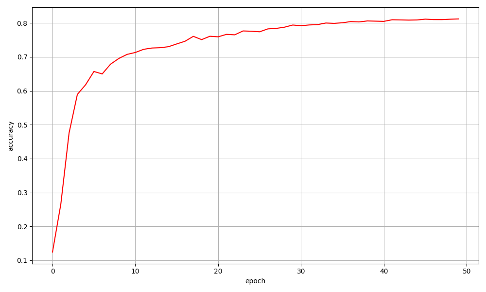

# 计算机视觉中的深度学习方法 大作业 张乃心

## 1. 实验模型

使用 [timm](https://github.com/huggingface/pytorch-image-models) 库中的模型来进行训练。卷积神经网络和视觉 Transformer 各选择一个，使用 CIFAR100 的 32x32 图像大小和 100 个类来初始化网络。

卷积神经网络：

```python
nfnet = timm.create_model(
        "dm_nfnet_f0.dm_in1k", 
        pretrained=True, 
        num_classes=100,
    )
```

Vision Transformer：

```python
vit = timm.create_model(
        "vit_base_patch8_224.augreg_in21k_ft_in1k",
        pretrained=True,
        num_classes=100,
        img_size=(32, 32),
    )
```

## 2. 实验超参数

使用 AdamW 优化器，学习率 Cosine 衰减。训练使用的其他超参数如下：

```python
epochs=50
batch_size=256
learning_rate=1e-4
weight_decay=1e-4
```

在上述默认参数的基础上，实验分别对卷积网络和 ViT 进行了训练。此外，还探究了学习率对于模型训练的影响。

## 3. 实验结果

训练的最终损失和准确率如下表：

| 模型   | 学习率  | 准确率(%)   |
| ----  | ----   |  ----      |
| NfNet | 1e-4   |  75.53     |
| NfNet | 1e-3   |  74.99     |
| ViT   | 1e-4   |  81.21     |

使用 NFnet 和学习率 1e-4 进行训练的损失和准确率变化如下：
")
")

使用 ViT 进行训练的训练损失变化如下：



使用 NFnet 和学习率 1e-3 进行训练的损失和准确率变化如下：
")
")

可以发现，使用预训练模型进行训练，即使只训练 50 个 epochs，且图像大小和语序年大小不匹配，最终依然可以得到较好的结果（最高准确率 81.21%）。对比 CNN 和 ViT，可能由于 ViT 在更大的数据集上进行了预训练，在 CIFAR100 上的微调效果相比 CNN 要更好一些。使用不同的学习率对最终效果有影响，但在此次实验中，选用 1e-4 和 1e-3 的效果区别不太大。

## 4. 加分点

（1）使用 timm 的模型
（2）使用 timm 的数据增强
（3）使用 timm 的 Loss
（4）探索不同学习率对训练的影响
（5）训练了 CNN 和 ViT 并进行了比较
